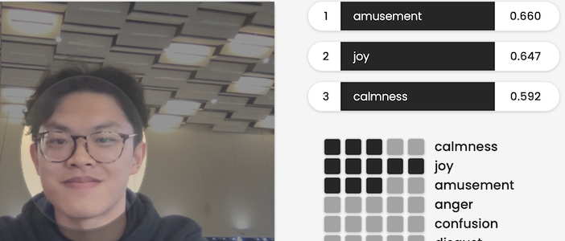

# CalHacks Summer 2023 Devpost!

## Inspiration  
Have you ever been teaching a class and all of your students look like they're fighting for their lives to stay awake?

As Teaching Assistants here at UC Berkeley, it's quite common to see a classroom full of uninterested students, but it is also difficult to *add activities or pose questions on the spot* to re-engage your students. Additionally, it's often difficult to gauge exactly how your students are feeling at certain times and see how your students are reacting to *different pedagogical styles*, especially when teaching online.   

EdGauge serves to **provide a third eye for educators**, making teaching more engaging.  

## What EdGauge does  
Essentially, EdGauge combines state-of-the-art **large language models** with **real-world applications of computer vision** in order to provide *instant feedback and advice* for educators by capturing the nuances behind facial behaviors and identifying students' emotions.

As an educator records their students in a classroom, EdGauge keeps track of the average emotions of all students. Through the press of a button, once a boredom percentage threshold is exceeded, or through a set time limit, EdGauge provides feedback on the average negative emotions and how to improve them by including potential solutions. Educators can then select the solution they would like to utilize and gain step-by-step walkthroughs of the examples with answers and potential followup questions.

EdGauge also saves these analytics per teaching session, providing educators with a summary of students' emotions and how they fluctuated based on new pedagogical approaches. Additionally, EdGauge tracks average student sentiments over time, showing how their engagement is changing as the course progresses.

For example, let's say Vanessa is teaching a discussion section on left-leaning red-black trees for her data structures class. Ten minutes into the discussion, 60% of her students are tracked to be bored. Because she set a threshold of 60% boredom, EdGauge sends Vanessa a notification that her students are looking quite bored, and provides four actionable ways to make the lesson more engaging. Vanessa selects the option of incorporating hands-on activities, and EdGauge provides her with a step-by-step breakdown of a hands-on activity starting from dividing students into individual groups to asking groups to present their creations.

**Target audience:** Educators, for any age, on any subject, and through any means (in-person or remote), to improve student engagement and boost learning experiences.

## How we built it
### 1. Video & Data Streaming

We begin by utilizing the cv2 libraries to enable an instance of webcam access to live-stream the video input of the teacher's students in the classroom. This detects students' faces and begins keeping track of how they are changing. We enabled asyncio for the app to constantly seek new frames of video for analysis.

### 2. Active Contextualization

EdGauge intelligently leverages the sentiment analysis information from Hume API by storing percentages of emotions to best understand overall climate. Given this information, it then creates a unique & relevant request to OpenAI's GPT-4 API. Here's an example of Hume's API.

### 3. Filtering-Based Recommendation

We present all of our LLM capabilities and recommendation system to the teacher by displaying our suggestions in a simple, educator-friendly way. Having an easy to use platform is important in education, which is why our design minimizes the number of buttons and miscellaneous components for one to use.

## What we're proud of
This was our first hackathon for 3/4 members of our team! From spending hours brainstorming open-ended solutions to our everyday inconveniences to attending workshops and learning about successful, like-minded startups, this hackathon has been an incredible, invaluable learning experience for all of us.  

EdGauge is a **product of our personal teaching needs**. By facing common classroom issues surrounding boredom, needing feedback, and instant examples, as teaching assistants and classroom facilitators, we've found necessity in creating a product that helps both us and our students.

We all worked on something we've never done before and continued to explore our personal technological interests to create a final product that we personally find use in. 

## What's next for EdGauge  
We believe EdGauge has the potential to revolutionize teaching, as declining interest and attention-span within classrooms have become a rising issue. On a larger scale, EdGauge would be able to learn best teaching practices for engaging students, and start recommending pedagogical strategies to encourage collaborative classroom communities.